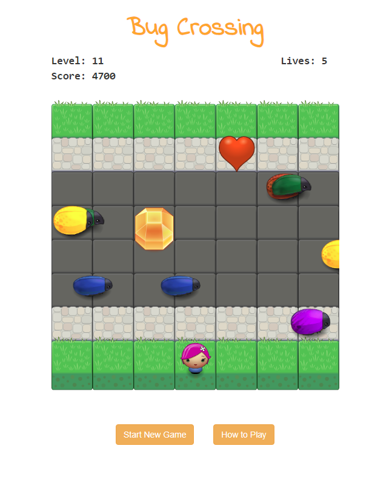

Bug Crossing
===============================

This game is a project created as a part of Udacity's Front-End Web Developer Nanodegree and the goal is to cross the street without getting run over by bugs.

## Demo
You can play the game at [http://kellim.github.io/arcade-game](http://kellim.github.io/arcade-game)

## About this Project

This project uses [starter code from Udacity](https://github.com/udacity/frontend-nanodegree-arcade-game) that includes the game engine in `engine.js`, and an image loading utility in `resources.js`, among other files. Most of my code is in `app.js`, but I also made a few changes to `engine.js` and updated `index.html` and `style.css`. Visual assets were also provided, and I edited some of the graphics.

## Gameplay and Objective
Each level, you'll start in the grass at the bottom, and you'll need to cross the road to get to the grass at the top. Once you reach the grass at the top, you'll be awarded 100 points and find yourself back at the bottom ready to start the next level.

You can move using the up, down, left, and right arrow keys.

If you collide with a bug, you lose 50 points and go back to your starting place in the grass.

Each level, you will have an opportunity to get a heart and a gem. The heart gives you an extra life and the gem gives you 500 points.

To win the game, you must pass all 20 levels. 

BEWARE: As you level up, the bugs get faster, and you'll also notice more bugs! 

## Tips
Collect hearts for extra lives, especially at lower levels, because you'll likely need them once you get to the higher levels.

Sometimes you can wait for a bit and find an opening where you can take a straight path across the road quickly.

If a heart or gem is on the street near the stony sidwalk at the top, you can try to make it all the way to the sidewalk first, and then walk over so you are above the item and quickly step down to get it while there are no bugs around. But beware, at later levels you will notice the sidwalks being infiltrated by bugs!

## Contributions

No contributions will be accepted for this project.

## License

I have not included a license for this project as it has Udacity starter code that does not have an open source license.
